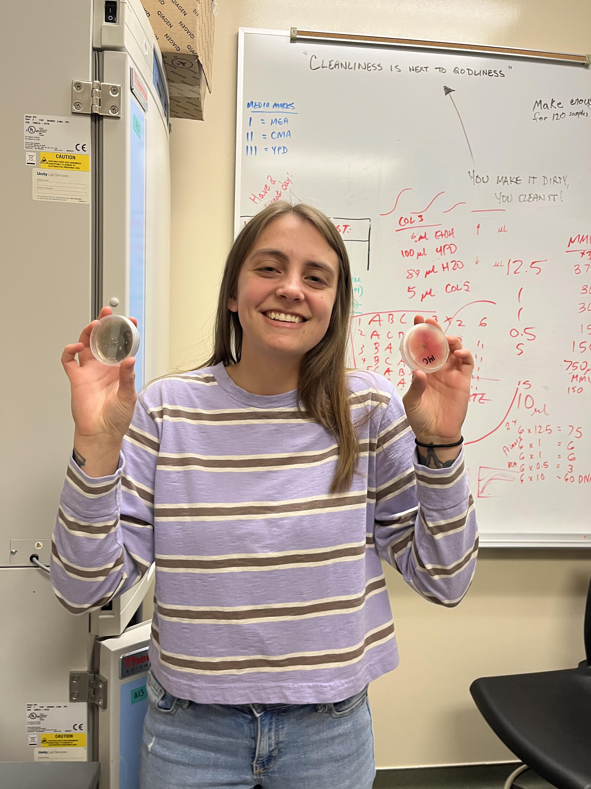

<p style="font-family: times; font-size:15pt">
I am a current biology student at Utah Valley University, set to graduate Fall of 2023. I have received a National Science Foundation S-STEM fellowship that has allowed me to conduct my own research while attending school full-time. My main interests are mycology, ecology, marine sciences, animal/environment interactions, and bioinformatics. I am attending school to broaden my mind, world view, hone my research skills and eventually become a professor at an accredited university. 
\
After my time at UVU, I plan to pursue a PhD. I am currently on the search for a great mentor who has a passion to teach. If you enjoy what you see through this page, please email me! I would be happy to chat :)
Take your time browsing my other tabs and learning more about me, the techniques I've learned, and the research that I do. I have spent many hours working on this website in R studio and I hope you enjoy.
</p>
```{r, echo=FALSE, out.width="37%", fig.cap="**A Day in the Life**"}

```
